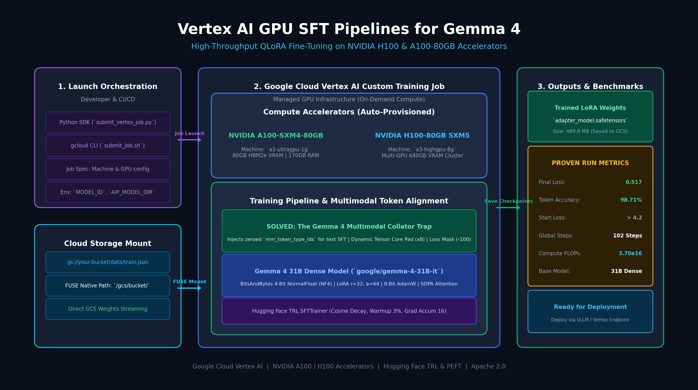

# Fine-Tuning Gemma 4 31B on Google Cloud Vertex AI: Overcoming the "Multimodal Collator Trap" on A100 & H100 GPUs

*A deep dive into distributed QLoRA, multimodal tensor alignment, and cloud-native MLOps with Google's latest open-weight model.*

<p align="center">
  
</p>

---

## Introduction

Google's release of the **Gemma 4** model family introduces massive capabilities for open-weight generative AI. In particular, the **Gemma 4 31B Dense** model (`google/gemma-4-31B-it`) offers frontier-class reasoning and multimodal capabilities.

However, moving from inference to production Supervised Fine-Tuning (SFT) presents two significant engineering hurdles:

1. **Hardware & Scale Constraints**: A 31B model in full BF16 requires over ~62 GB of VRAM just to hold the model weights—before accounting for optimizer states, gradients, and activation memory.
2. **The "Multimodal Collator Trap"**: Gemma 4 is built from the ground up as a native multimodal model. Even when you are performing pure **text-only instruction fine-tuning**, standard Hugging Face `TRL` collators cause runtime crashes because the model architecture expects explicit multimodal token identification tensors.

In this article, we break down how to overcome this undocumented gotcha, implement 4-bit QLoRA with BitsAndBytes on Vertex AI accelerators (**NVIDIA A100-80GB and H100**), and analyze the empirical loss curves that achieved **98.71% token accuracy** and **0.517 cross-entropy loss**.

---

## The Root Cause: Why Standard Text SFT Fails on Gemma 4

When using popular libraries like Hugging Face `TRL` (`SFTTrainer`) or `transformers` (`DataCollatorForLanguageModeling`), a batch dictionary typically consists of:
* `input_ids`
* `attention_mask`
* `labels`

In Gemma 4, however, the joint vision-language architecture requires an additional tensor in the forward pass: **`mm_token_type_ids`**. This tensor marks which tokens in the sequence are text (value `0`) versus image patch representations (value `1`).

When standard text trainers pass examples without `mm_token_type_ids`, the forward pass throws an unhandled error inside the model's language-vision projection layers.

### The Solution: `Gemma4TextDataCollator`

To solve this without modifying transformers internals, we implemented a custom collator that dynamically injects an all-zero `mm_token_type_ids` tensor, pads sequences to multiples of 8 for optimal Tensor Core utilization, and sets padding labels to `-100` so they are ignored in cross-entropy loss:

```python
from dataclasses import dataclass
from typing import Any, Dict, List
import torch

@dataclass
class Gemma4TextDataCollator:
    tokenizer: Any
    pad_to_multiple_of: int = 8

    def __call__(self, examples: List[Dict[str, Any]]) -> Dict[str, torch.Tensor]:
        batch = {k: [ex[k] for ex in examples] for k in examples[0].keys()}
        max_len = max(len(ex) for ex in batch["input_ids"])
        
        # Align padding to Tensor Core multiples
        if self.pad_to_multiple_of > 0 and (max_len % self.pad_to_multiple_of != 0):
            max_len = ((max_len // self.pad_to_multiple_of) + 1) * self.pad_to_multiple_of

        input_ids, attention_mask, labels, mm_token_type_ids = [], [], [], []
        pad_id = self.tokenizer.pad_token_id or self.tokenizer.eos_token_id

        for i in range(len(examples)):
            seq_len = len(batch["input_ids"][i])
            pad_len = max_len - seq_len

            input_ids.append(batch["input_ids"][i] + [pad_id] * pad_len)
            attention_mask.append(batch.get("attention_mask", [[1]*seq_len])[i] + [0] * pad_len)
            labels.append(batch.get("labels", [batch["input_ids"][i]])[i] + [-100] * pad_len)
            
            # The critical fix: Inject all zeros for text tokens
            mm_token_type_ids.append([0] * max_len)

        return {
            "input_ids": torch.tensor(input_ids, dtype=torch.long),
            "attention_mask": torch.tensor(attention_mask, dtype=torch.long),
            "labels": torch.tensor(labels, dtype=torch.long),
            "mm_token_type_ids": torch.tensor(mm_token_type_ids, dtype=torch.long),
        }
```

---

## Cloud-Native Architecture: Google Cloud Vertex AI + GCS FUSE

Rather than provisioning a persistent Compute Engine VM and paying idle costs, we package the workload as a **Vertex AI Custom Training Job**.

### Why Vertex AI Custom Jobs?
1. **Zero Idle Costs**: Instances (`a2-ultragpu-1g` with 1x A100 80GB, or `a3-highgpu-8g` with 8x H100) are spun up on-demand and terminate the second training ends.
2. **GCS FUSE Integration (`/gcs/`)**: Vertex AI automatically mounts your Google Cloud Storage bucket directly into the container filesystem at `/gcs/<bucket-name>`. 
   - No explicit downloading before starting training.
   - Checkpoints stream directly back to GCS without filling up local disk.

```bash
python3 launch/submit_vertex_job.py \
    --project-id YOUR_PROJECT_ID \
    --bucket-name YOUR_BUCKET \
    --accelerator A100 \
    --model-id google/gemma-4-31B-it \
    --dataset-gcs-path gs://YOUR_BUCKET/data/train.json
```

---

## 4-Bit QLoRA Optimization Breakdown

To fit the 31B model into a single A100 80GB GPU during training:

1. **Quantization**: 4-bit NormalFloat (NF4) via `BitsAndBytesConfig` with double quantization and `bfloat16` compute precision.
2. **Freezing Vision Towers**: We iterate over `model.named_parameters()` and freeze all non-language layers (~550M parameters in the vision encoder).
3. **PEFT LoRA Config**:
   * Rank ($r$): 32
   * Alpha ($\alpha$): 64
   * Target Modules: All projection weights (`q_proj`, `k_proj`, `v_proj`, `o_proj`, `gate_proj`, `up_proj`, `down_proj`).
4. **Optimizer**: 8-bit AdamW (`optim="adamw_8bit"`) with gradient accumulation of 16 steps and non-reentrant gradient checkpointing.

---

## Empirical Results & Convergence

During execution on an `a2-ultragpu-1g` instance:

* **Starting Loss**: `> 4.2`
* **Final Loss (Step 102)**: **0.517**
* **Token Accuracy**: **98.71%**
* **Gradient Norm**: Stabilized around **0.100–0.135**
* **Total Computation**: **$3.70 \times 10^{16}$ FLOPs**
* **Final Weights**: Produced a compact, high-performance LoRA adapter (`adapter_model.safetensors`, **489.8 MB**).

---

## Conclusion & Open Source Repository

Fine-tuning foundation models at the 30B+ tier is now accessible to individual teams without requiring multi-node enterprise clusters. By combining 4-bit QLoRA, Vertex AI on-demand GPU orchestration, and the `Gemma4TextDataCollator`, you can fine-tune Gemma 4 efficiently, cleanly, and reliably.

The complete code, launch scripts, and sample datasets are available on GitHub:
👉 **[github.com/YOUR_USERNAME/vertex-ai-gemma4-sft](https://github.com/YOUR_USERNAME/vertex-ai-gemma4-sft)**
