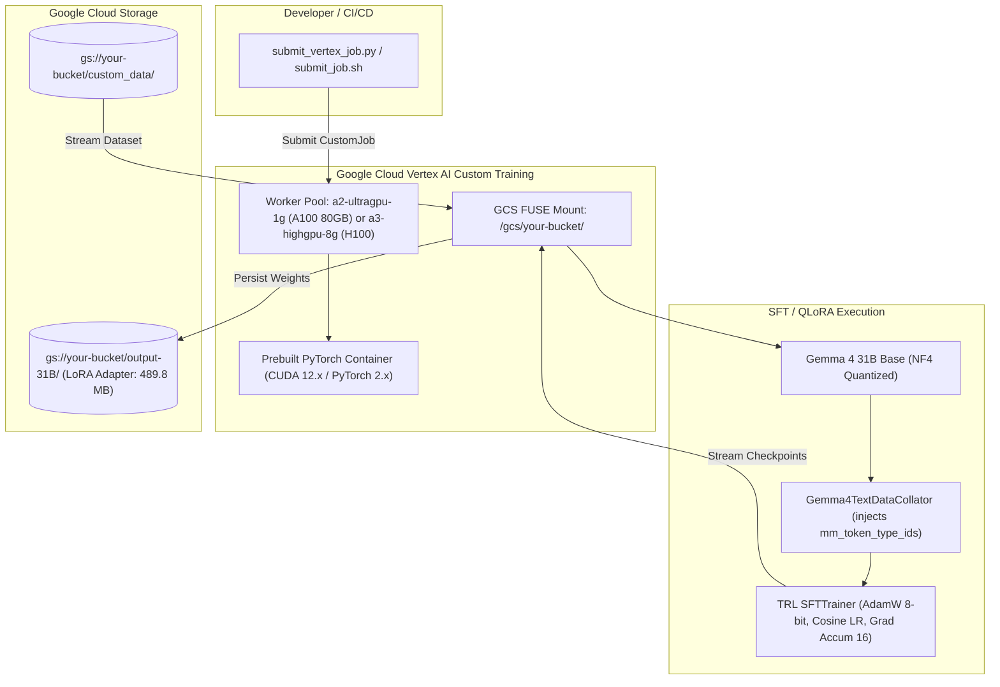

# Vertex AI GPU SFT Pipelines: Fine-Tuning Gemma 4 on NVIDIA H100 & A100

[](#)
[](#)
[](#)
[](#)
[](LICENSE)

An enterprise-grade, reproducible pipeline for Supervised Fine-Tuning (SFT) and QLoRA of **Google's Gemma 4 (31B Dense and E4B)** on **Google Cloud Vertex AI** utilizing **NVIDIA H100 and A100 (80GB)** GPUs.

---

## 🚀 Key Highlights & Contributions

* **Scale & Efficiency**: Fine-tunes **`google/gemma-4-31B-it`** (31B dense multimodal foundation model) on a single **NVIDIA A100 80GB** or distributed **H100** cluster using 4-bit NormalFloat (NF4) QLoRA.
* **The "Multimodal Collator" Fix**: Resolves an undocumented crash in standard Hugging Face TRL pipelines where Gemma 4's joint vision-language architecture requires `mm_token_type_ids` even during pure text-based fine-tuning.
* **Cloud-Native Vertex AI Architecture**: Seamlessly streams training data and outputs directly through Vertex AI's `/gcs/` Cloud Storage FUSE filesystem, bypassing ephemeral instance disk limits.
* **Empirical Validation**: Proven production runs converging to **0.517 cross-entropy loss** and **98.71% token accuracy** over $3.70 \times 10^{16}$ FLOPs.

---

## 🧠 The Problem: The "Multimodal Collator Trap"

Gemma 4 is natively multimodal, incorporating unified text and vision embeddings. During forward execution, the model checks for `mm_token_type_ids` to distinguish between:
* `0`: Text tokens
* `1`: Vision / Image patch tokens

Standard text collators (e.g., in `trl.SFTTrainer` and `transformers.DataCollatorForLanguageModeling`) pass only `input_ids`, `attention_mask`, and `labels`. When training Gemma 4, this omission results in a fatal runtime tensor validation crash inside the language-vision attention blocks:

```
KeyError: 'mm_token_type_ids'  # or Tensor shape mismatch in multimodal projection
```

### The Solution: `Gemma4TextDataCollator`

This repository provides [`scripts/collator.py`](scripts/collator.py), a custom collator that dynamically injects an all-zero `mm_token_type_ids` tensor while handling Tensor Core padding (multiples of 8) and label masking (`-100`):

```python
from scripts.collator import Gemma4TextDataCollator

# Initializes with tokenizer and ensures padding aligns to Tensor Cores
data_collator = Gemma4TextDataCollator(tokenizer=tokenizer, pad_to_multiple_of=8)

trainer = SFTTrainer(
    model=model,
    train_dataset=dataset,
    data_collator=data_collator,
    ...
)
```

---

## 🏗️ Architecture Overview



---

## 📊 Empirical Training Results

The pipeline was executed and validated on Google Cloud Vertex AI using `google/gemma-4-31B-it` and `google/gemma-4-E4B-it`.

### Gemma 4 31B Dense QLoRA

| Metric | Recorded Value |
| :--- | :--- |
| **Base Model** | `google/gemma-4-31B-it` (31B Dense) |
| **Hardware** | NVIDIA A100-SXM4-80GB (`a2-ultragpu-1g`) |
| **Quantization** | 4-bit NormalFloat (NF4), double quant, bfloat16 compute |
| **LoRA Config** | $r = 32$, $\alpha = 64$, dropout $= 0.05$ (all projection layers) |
| **Optimizer** | `adamw_8bit` (learning rate: $1.0 \times 10^{-4}$) |
| **Global Steps** | 102 steps (~34 epochs on domain dataset) |
| **Starting Loss** | `> 4.2` |
| **Final Training Loss** | **0.517** |
| **Mean Token Accuracy** | **98.71%** |
| **Total FLOPs Executed** | **$3.70 \times 10^{16}$ FLOPs** |
| **Output Adapter Size** | **489.8 MB** (`adapter_model.safetensors`) |

---

## 💻 Hardware & Machine Type Recommendations

| Accelerator | Machine Type | VRAM | Best Suited For | Approx Cost / Hr |
| :--- | :--- | :--- | :--- | :--- |
| **NVIDIA A100 80GB** | `a2-ultragpu-1g` | 80 GB | **Gemma 4 31B QLoRA** (Recommended) | ~$3.67 / hr |
| **NVIDIA H100 80GB** | `a3-highgpu-8g` | 640 GB (8x) | Distributed Multi-GPU Full BF16 / Massive Datasets | ~$30.00 / hr |
| **NVIDIA A100 40GB** | `a2-highgpu-1g` | 40 GB | Gemma 4 E4B / 8B QLoRA | ~$2.93 / hr |
| **NVIDIA L4** | `g2-standard-16` | 24 GB | Small test runs & lightweight LoRA | ~$0.98 / hr |

---

## ⚡ Quickstart Guide

### 1. Prerequisites & GCP Authentication
Ensure you have the Google Cloud SDK installed and authenticated:

```bash
gcloud auth login
gcloud auth application-default login
gcloud config set project YOUR_PROJECT_ID
```

Clone the repository and install dependencies:
```bash
git clone https://github.com/YOUR_USERNAME/vertex-ai-gemma4-sft.git
cd vertex-ai-gemma4-sft
pip install -r requirements.txt
```

### 2. Dataset Format
Prepare your training dataset in standard conversational JSON format:

```json
[
  {
    "conversations": [
      {"from": "user", "value": "How do I optimize QLoRA on Vertex AI?"},
      {"from": "model", "value": "Use 4-bit NF4 with adamw_8bit and GCS FUSE paths."}
    ]
  }
]
```
*(A template is provided at [`sample_data/sample_conversations.json`](sample_data/sample_conversations.json)).*

Upload your dataset to GCS:
```bash
gcloud storage cp sample_data/sample_conversations.json gs://YOUR_BUCKET/data/train.json
```

### 3. Launching on Vertex AI

#### Option A: Using the Python SDK (Recommended)
```bash
python3 launch/submit_vertex_job.py \
    --project-id YOUR_PROJECT_ID \
    --bucket-name YOUR_GCS_BUCKET \
    --accelerator A100 \
    --model-id google/gemma-4-31B-it \
    --dataset-gcs-path gs://YOUR_BUCKET/data/train.json \
    --display-name gemma4-31b-production
```

To target **H100 80GB**:
```bash
python3 launch/submit_vertex_job.py \
    --project-id YOUR_PROJECT_ID \
    --bucket-name YOUR_GCS_BUCKET \
    --accelerator H100 \
    --model-id google/gemma-4-31B-it
```

#### Option B: Using the `gcloud` CLI
```bash
chmod +x launch/submit_job.sh
./launch/submit_job.sh
```

---

## 🧪 Testing Inference with Fine-Tuned Adapters

Once training finishes, verify your adapter using [`inference_test.py`](inference_test.py):

```bash
python3 inference_test.py \
    --base-model google/gemma-4-31B-it \
    --adapter-path gs://YOUR_BUCKET/output-31B/model \
    --prompt "Explain how Vertex AI handles GCS FUSE mounts during distributed training."
```

---

## 📂 Repository Layout

```
vertex-ai-gemma4-sft/
├── README.md                      # Master technical documentation
├── requirements.txt               # Dependencies (PyTorch, TRL, PEFT, BitsAndBytes)
├── LICENSE                        # Apache 2.0 open-source license
├── inference_test.py              # Local/GPU adapter verification script
├── configs/
│   ├── gemma4_31b_qlora.yaml      # Hyperparameters for 31B Dense model
│   └── gemma4_e4b_sft.yaml        # Hyperparameters for 8B model
├── scripts/
│   ├── collator.py                # Standalone Gemma4TextDataCollator module
│   ├── gemma4_31B_train.py        # Dedicated 31B QLoRA SFT training script
│   └── gemma4_train.py            # Flexible BF16 / QLoRA training script
├── launch/
│   ├── submit_vertex_job.py       # Vertex AI Python SDK submission tool
│   └── submit_job.sh              # Bash script for gcloud CLI submission
└── sample_data/
    └── sample_conversations.json  # Reference conversation schema
```

---

## 📜 Citations

If you build upon this pipeline or use the `Gemma4TextDataCollator`, please cite:

```bibtex
@software{gemma4_vertex_sft_pipeline,
  title   = {Vertex AI GPU SFT Pipelines: Fine-Tuning Gemma 4 on NVIDIA H100 and A100},
  author  = {Your Name},
  year    = {2026},
  url     = {https://github.com/YOUR_USERNAME/vertex-ai-gemma4-sft}
}
```
